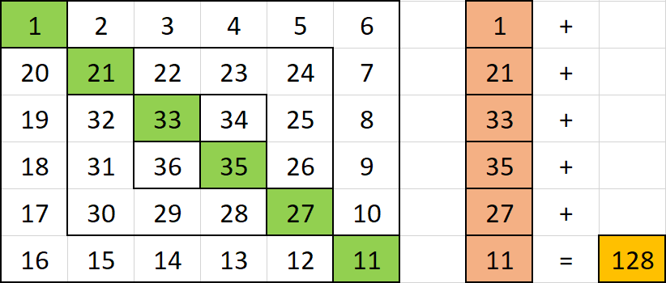

# Multidimensional arrays exercises - Taken from pbinfo.ro

## Clasa IX-a => Tablouri Bidimensionale(matrice) => Parcurgerea matricelor patratice => Mediu

11. Create a C++ program which will scroll through a matrix in spiral, clockwise. The matrix has `n` rows and `n` columns

    - Sample Input:
      - n = 4
      - ```json
          1   2   3   4
          5   6   7   8
          9   10  11  12
          13  14  15  16
        ```
    - Sample Output:
      ```json
          1 2 3 4 8 12 16 15 14 13 9 5 6 7 11 10
      ```
    - Solution:

      ```c++
        #include <iostream>
        #include <fstream>

        using namespace std;

        int main() {
            ifstream fin;
            ofstream fout;
            fin.open("spirala.in");
            fout.open("spirala.out");

            int n;
            fin >> n;
            int mat[n][n];
            for (int i = 0; i < n; i++) {
                for (int j = 0; j < n; j++) {
                    fin >> mat[i][j];
                }
            }

            int rowStartIndex = 0;
            int rowEndIndex = n - 1;
            int columnStartIndex = 1;
            int columnEndIndex = n - 1;

            while (rowStartIndex < rowEndIndex) {
                //displayTop;
                for (int i = rowStartIndex; i <= rowEndIndex; i++) {
                    fout << mat[rowStartIndex][i] << " ";
                }

                // display last column
                for (int i = columnStartIndex; i <= columnEndIndex; i++) {
                    fout << mat[i][columnEndIndex] << " ";
                }
                columnStartIndex++;
                columnEndIndex--;

                //display bottom row
                for (int i = columnEndIndex; i >= rowStartIndex; i--) {
                    fout << mat[rowEndIndex][i] << " ";
                }

                // display first column
                for (int i = columnEndIndex; i > rowStartIndex; i--) {
                    fout << mat[i][0] << " ";
                }

                rowStartIndex++;
                rowEndIndex--;

            }
            return 0;
        }

      ```

12. Given a 2D Array with natural elements, create a C++ program which will find the last digit of the product of the elements on the secondary diagonal with the property that they are minimal on their columns.

- Sample Input:
  ```json
    4
    3 4 90 10
    25 2 7 9
    18 3 10 4
    3 7 20 3
  ```
- Sample Output: `1`
- Solution:

  ```c++
    #include <iostream>
    #include <fstream>

    using namespace std;

    int main() {
        ifstream fin;
        ofstream fout;
        fin.open("mincols1.in");
        fout.open("mincols1.out");
        int n;
        fin >> n;
        int columnsMin[n];

        int mat[n][n];
        for (int i = 0; i < n; i++) {
            for (int j = 0; j < n; j++) {
                fin >> mat[i][j];
            }
        }

        for(int i = 0; i < n;i++) {
            columnsMin[i] = mat[i][0];
            for(int j = 0; j < n; j++) {
                if(mat[j][i] < columnsMin[i]){
                    columnsMin[i] = mat[j][i];
                }
            }
        }

        int product = 1;

        for(int i =0; i < n; i++){
            for(int j = 0; j < n; j++) {
                if((j == n-i-1) && (mat[i][j] ==  columnsMin[j])) {
                    product *= mat[i][j];
                }
            }
        }

        fout << product % 10;
        return 0;
    }

  ```

13. Given a 2D array with integer elements, create a C++ program which will compute the average of the strictly positive elements in the matrix which are located below the main diagonal.

- Sample Input (`medpoz.in`):
  ```json
    4
    -1 2 4 5
    0 6 3 1
    2 4 2 0
    3 -5 1 -3
  ```
- Sample Output: `2.5`
- Solution:

  ```c++
    #include <iostream>
    #include <fstream>

    using namespace std;

    int main() {
        ifstream fin;
        ofstream fout;
        fin.open("medpoz.in");
        fout.open("medpoz.out");
        int n;
        fin >> n;

        int mat[n][n];
        for (int i = 0; i < n; i++) {
            for (int j = 0; j < n; j++) {
                fin >> mat[i][j];
            }
        }

        double sum = 0.0;
        int count = 0;

        for(int i = 0; i < n; i++) {
            for(int j =0; j < n; j++) {
                if(i > j && mat[i][j] > 0) {
                    sum+= mat[i][j];
                    count++;
                }
            }
        }

        fout << sum / count;

        return 0;
    }

  ```

14. After the disaster caused by the hacker Gigel (#Overload), the network administrator decided to take action.

It is responsible for a network with n \* n computers arranged in the form of a 2D array with n rows and n columns, in which each computer is connected to adjacent computers (up, right, left, down), each computer in row n is connected to the computer on row 1 and the same column, and each computer on row n is connected to the one on column 1 and the same row.

In this network, there are encrypted computers that cannot receive corrupt data packets. Unencrypted computers can receive corrupt packets but cannot process them. Their behavior is different: when an unencrypted computer receives a packet of data, it forwards it to the next computer in the same direction until they encounter an encrypted computer. The computer that contains the corrupted data packet can then receive a command to forward it in another direction.

The network becomes overloaded if the corrupted packet reaches a row or column that contains only unencrypted computers, so that it can be transmitted indefinitely.

Hacker Gigel took advantage of this network weakness and managed to give commands through computer terminals so that the data packet was transmitted indefinitely between them, overloading the network, (see the issue #Overload).

The network administrator has decided to encrypt enough computers to avoid any possibility of network overload. Because encrypting a single computer takes a long time, the administrator wants to know the minimum number of computers that need to be encrypted so that the Gigel hacker can no longer have fun with the network.

The `encryption.in` input file contains the number n on the first line, followed by n rows with n numbers. A value of 1 represents an already encrypted computer, and a value of 0 represents an unencrypted computer.

The `encryption.out` output file will contain the Sol number on the first line, representing the minimum number of computers that need to be encrypted, and on the next Sol rows a pair of x and y numbers representing that on the x line and y column the computer must be encrypted.

- Sample Input (`criptare.in`):

  ```json
  5
  0 0 0 0 0
  1 1 1 1 1
  1 0 1 1 0
  0 1 0 1 0
  0 0 0 0 0
  ```

- Sample Output (`criptare.out`):
  ```json
    2
    1 1
    5 3
  ```
- Solution:

  ```c++
    #include <iostream>
    #include <fstream>

    using namespace std;
    int computersEncrypted[1000][1000] = { 0 };
    int main() {
        ifstream fin;
        ofstream fout;
        fin.open("criptare.in");
        fout.open("criptare.out");
        int n;
        fin >> n;

        int mat[n][n];
        for (int i = 0; i < n; i++) {
            for (int j = 0; j < n; j++) {
                fin >> mat[i][j];
            }
        }
        int sol = 0;

        for (int i = 0; i < n; i++) {
            bool isAllZeroes = true;
            for (int j = 0; j < n; j++) {
                if (mat[i][j] == 1) {
                    isAllZeroes = false;
                }
            }

            if (isAllZeroes) {
                mat[i][0] = 1;
                computersEncrypted[i][0] = 1;
                sol++;
            }
        }

        for (int i = 0; i < n; i++) {
            bool isAllZeroes = true;
            for (int j = 0; j < n; j++) {
                if (mat[j][i] == 1) {
                    isAllZeroes = false;
                }
            }

            if (isAllZeroes) {
                mat[i][0] = 1;
                computersEncrypted[0][i] = 1;
                sol++;
            }
        }
        fout << sol << endl;
        for (int i = 0; i < n; i++) {
            for (int j = 0; j < n; j++) {
                if (computersEncrypted[i][j] != 0) {
                    fout << i+1 << " " << j+1 << endl;
                }
            }
        }
        return 0;
    }
  ```

15. Give n natural numbers, an n is a perfect square. Construct in memory a square matrix with all n numbers, in a spiral, counterclockwise as follows: on the first column, starting with line 1, the first elements in the row (from top to bottom) will be passed, then on last row, starting from the first column to the last (from left to right), then on the last column, from the last row to the first (bottom to top), then on the first row, from the last column to the first right to left) and so on.

The `spiral1.in` input file contains the number n on the first line, and the n numbers on the next line.
The output file `spiral1.out` will contain the constructed array, one line of the array on one line of the file, the elements of each line being separated by exactly one space.

- Sample Input: (`spirala1.in`)
  ```json
      9
      2 6 7 3 7 1 7 1 5
  ```
- Sample Output: (`spirala1.out`)
  ```json
    2 1 7
    6 5 1
    7 3 7
  ```
- Solution:

  ```c++
    #include <iostream>
    #include <fstream>
    #include <cmath>

    using namespace std;
    int main() {
        ifstream fin;
        ofstream fout;
        fin.open("spirala1.in");
        fout.open("spirala1.out");

        int n;
        fin >> n;

        int squareRootOfN = sqrt(n);
        int mat[squareRootOfN][squareRootOfN];
        int allNumbers[n];

        for (int i = 0; i < n; i++) {
            fin >> allNumbers[i];
        }

        int startRowIndex = 0;
        int endRowIndex = squareRootOfN;
        int startColIndex = 0;
        int endColIndex = squareRootOfN;

        int i = 0;
        while (i < n) {

            //draw first column
            for(int j = startRowIndex; j < endRowIndex;j++) {
                mat[j][startColIndex] = allNumbers[i];
                i++;
            }
            startColIndex++;

            //draw last line
            for(int j = startColIndex; j < endColIndex; j++) {
                mat[endRowIndex-1][j] = allNumbers[i];
                i++;
            }

            endRowIndex--;

            //draw last column
            for(int j = endRowIndex-1; j >= startRowIndex; j--) {
                mat[j][endColIndex-1]=allNumbers[i];
                i++;
            }
            endColIndex--;

            // draw top line
            for(int j = endColIndex-1;j >= startColIndex;j--){
                mat[startRowIndex][j] = allNumbers[i];
                i++;
            }
            startRowIndex++;

        }

        for(int i = 0; i < squareRootOfN; i++) {
            for(int j = 0; j < squareRootOfN; j++) {
                fout << mat[i][j] << " ";
            }
            fout << endl;
        }

        return 0;
    }
  ```

16. Create a C++ program which Reads from input file a square matrix A with `n` rows and `n` columns and natural elements. The program should update the matrix as follows:

I. interchange the elements of the matrix in the upper triangle with the ones in the lower triangle of the matrix

II. then swap the distinct superprime elements, which appear in the right triangle with the left triangle of the matrix (both elements must be superprime);

A natural number n is called superprim if among the numbers that can be obtained by moving, in turn, the first digit of the number n and those obtained along the way, on the last position, there is at least one prime number. For example 124 is "super-prime" because of the numbers 241, 412 and 124, the number 241 is prime. 15 is not "super-prime" because neither 51 nor 15 are prime numbers.

- Sample Input (`matrice.in`):
  ```json
      1 3 4 2
      8 1 2 7
      124 2 1 32
      2 5 6 1
  ```
- Sample Output (`matrice.out`):
  ```json
      1 5 6 2
      8 1 2 7
      32 2 1 124
      2 3 4 1
  ```
- Solution:

  ```c++
    #include <iostream>
    #include <fstream>
    #include <cmath>

    bool isSuperPrime(int number);
    int moveFirstDigitToLastPosition(int number);
    bool isPrime(int number);

    using namespace std;
    int main() {

        ifstream fin;
        ofstream fout;
        fin.open("matrice.in");
        fout.open("matrice.out");

        int n;
        fin >> n;
        int matrix [n][n];

        for (int i = 0; i < n; i++) {
            for(int j = 0; j < n; j++) {
                fin >> matrix[i][j];
            }
        }

        for (int i = 0; i < n; i++) {
            for(int j = 0; j < n; j++) {
                //Interchange of upper triangle with lower triangle
                if(i <j  && j < (n-i-1)) {
                    int temp = matrix[i][j];
                    matrix[i][j] = matrix[n-1-i][j];
                    matrix[n-1-i][j] = temp;
                } else if(i > j  && j < n-1-i) {
                    if(isSuperPrime(matrix[i][j]) && isSuperPrime(matrix[i][n-1-j])) {
                        int temp = matrix[i][j];
                        matrix[i][j] = matrix[i][n-1-j];
                        matrix[i][n-1-j] = temp;
                    }
                }
            }
        }

        for (int i = 0; i < n; i++) {
            for(int j = 0; j < n; j++) {
                fout << matrix[i][j] <<" ";
            }
            fout << endl;
        }

        return 0;
    }

    bool isSuperPrime(int number) {
        bool result = false;
        int temp = moveFirstDigitToLastPosition(number);
        while(temp != number) {
            if(isPrime(temp)) {
                result = true;
                break;
            }
            temp = moveFirstDigitToLastPosition(temp);
        }
        return result;
    }

    int moveFirstDigitToLastPosition(int number) {
        int digits = log10(number);
        int firstDigit =(int) number / pow(10, digits);
        int numberWithoutFirstDigit =  number - firstDigit * (int)(pow(10, digits));
        return numberWithoutFirstDigit * 10 + firstDigit;

    }

    bool isPrime(int number) {
        bool result = true;
        for (int i = 2; i < number / 2; i++) {
            if (number % i == 0) {
                result = false;
                break;
            }
        }
        return result;
    }

  ```

17. Given `n` distinct points in the cartesian system, create a C++ program which finds the maximum number of points inside or on the sides of a square of side `k`, with integer coordinate points and sides parallel to the coordinate axes.

The `pct.in` input file contain on the first line the numbers `n` and `k` and on the second line and the following, `n` pairs of numbers representing coordinates of the points, separated by spaces.

The `pct.out` file will contain on the first line the maximum number of points situated inside or on the sides of a square with side equal to `k`.

- Sample Input (`pct.in`):

  ```json
      3 2
      1 1
      1 0
      3 4
  ```

- Sample Output (`pct.out`): 2
- Solution:

  ```c++
      #include <iostream>
      #include <fstream>
      #include <cmath>
      double distanceBetweenTwoPoints(int x1, int y1, int x2, int y2);
      using namespace std;
      int main() {
            ifstream fin;
            ofstream fout;
            fin.open("pct.in");
            fout.open("pct.out");

            int n, k;
            fin >> n >> k;
            int matrix [n][2];

            for(int i =0; i < n; i++) {
                for(int j =0; j < 2; j++) {
                    fin >> matrix[i][j];
                }
            }

            int maxPointsInside = 0;

            for(int i =0; i < n; i++) {
                int numbersInside = 0;
                for(int j =0; j< n; j++) {
                    if(distanceBetweenTwoPoints(matrix[i][0], matrix[i][1], matrix[j][0], matrix[j][1]) <=k) {
                        numbersInside++;
                    }
                }
                if(maxPointsInside < numbersInside) {
                    maxPointsInside = numbersInside;
                }

            }

            fout << maxPointsInside;

            return 0;
        }

        double distanceBetweenTwoPoints(int x1, int y1, int x2, int y2) {
            double sum = pow((x1-x2), 2) + pow((y1-y2),2);
            return sqrt(sum);
        }

  ```

18. Antonia, a ninth grade student, bored with chemistry tests and lessons, decides to create a game. She chooses two nonzero natural numbers, `n` and `k`, with the help of which she constructs a square matrix `n` x `n` in a spiral shape (from outside to inside, as in the figure below). Then, the girl fills the matrix with consecutive nonzero natural numbers, starting from k. The aim of the game is to calculate the sum of the elements on the main diagonal, but the girl has only 0.1 seconds until the teacher notices that she is not paying attention to the classes. For `n` = `6` and `k` = `1`, the matrix would look like this:
    

Create a C++ program which will help Antonia to compute the sum of the elements on the main diagonale.
The file `wisp.in` will contain on one line the numbers `n` and `k`, separated by a space, where `n` represents the number of lines and columns, and `k` is the value of the first element, placed on first row and first column.

The file `wisp.out` will contain a single number `s`, the sum of the elements on the main diagonale

- Sample Input (`wisp.in`):
  ```json
      6 1
  ```
- Sample Output (`wisp.out`): 128
- Solution:

  ```c++
      #include <iostream>
      #include <fstream>

      using namespace std;
      int main() {
            ifstream fin;
            ofstream fout;
            fin.open("wisp.in");
            fout.open("wisp.out");

            int n, k;

            fin >> n >> k;

            int sum = k;
            int lastDistance = 0;
            for(int i = 1; i < n; i++) {
                if(i % 2 == 1) {
                    lastDistance = 2*n - 2*i;
                }
                k = k+ lastDistance;
                sum +=k;
            }
            fout << sum;

            return 0;
        }
  ```
