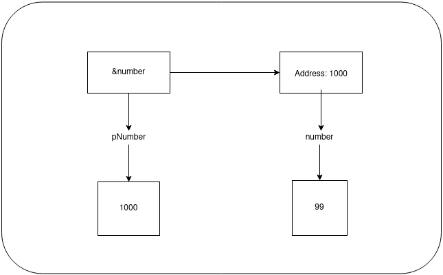

# Pointers

## Objectives
    1. What is a pointer
    2. The relationship between pointers and arrays
    3. Using pointers with strings
    4. Declare and user arrays of pointers

## What is a Pointer
- Pointers are one of the most extraordinarily powerfull tools in the C language and also, the most confusing one if it is not used accordingly!
- When we first talked about memory, we said that whenever you, the developer, declare a variable, the computer allocates an area of memory. We refer to this area of memory using the variable name but once the program is compiled and running, the computer references it by the address of the memory location.
- Let's take a look at the following snippet:
    ```c
        int number = 5;
    ```
    - Here, memory is allocated to store an integer and we can simply reference it using the name `number`. The value 5 is stored in this area. 
    - The computer references the area using an address. The specific address where these data will be stored dependes on the operating system and the compiler used for compiling the program and most likely will be different on different systems (and even on different runs on the same system)
- In order to get the address of a variable, we use the symbol `&`. Let's take a look at the following snippet where we see how to find the address of a variable:
    ```c
        #include <iostream>

        using namespace std;
        int main() {
            int number = 10;
            cout <<"The address of number variable is: "<< &number;
            return 0;
        }
    ```
    - The most important part here is the fact that if you run this program for multiple times, most likely you will get a different address displayed. (Something of the form: `0x7ffc7cf9d8bc`)

- Now if we get back to our `number` variable, and exactly to what kind of variable is, it is a variable which has, as a value, the number 5. Now, what if we want to have a variable which has, as a value, an address? Well, this is a `pointer`:
    - `Pointers are variables that store addresses, and the address that's stored in a pointer, is usually that of another variable`

- Let's see another example:
    ```c
        #include <iostream>

        using namespace std;
        int main() {
            int number = 99;
            int *pNumber = &number;
            return 0;
        }
    ```
    - Above we have a pointer `pNumber` that contains the address of another variable, called `number`, which is an integer variable containing the value 99. The value that's stored in `pNumber` is the address of the first byte of number.
    - A schematic representation can 
        - 

    - As you see, we declare a pointer similar to an ordinary variable only that there is an asterisk prior to variable's name: `int *pointerToSomething`
- The first thing to note is that it is not enough to know that a particular variable, such as `pNumber` is a pointer. The developer, and more importantly, the compiler must know the type of data stored at the address to which the pointer points to.
    - Without this information, it's impossible to know how much memory is occupied or how to handle the contents of the memory to which it points
    - This has the following consequence: `Pointers of a specific type can only point to variables of that type` e.g `pointers to float` can only point to variables of type `float`.
    - Even if we repeat this kind of information, keep in mind that a pointer of a given type is written as `type*` (e.g `int* myPointer`)

- One special datatype of pointer is the pointer where the type is void (e.g `void* pointerToVoid`)
    - The type named `void` means abscence of the type, thus it can contain the address of a data item of any type.
    - Type `void*` is often used as a parameter type or return value type with functions that deal with data in a type-independent way.
    - Any kind of pointer can be passed around as a value of type void* and then cast to the appropriate type when you come to use it
    - We will see more about this later when we will talk abbout the `malloc` function which is used to allocate memory for use in your program and returns a pointer to the memory of type `void*`

### Declaring pointers deep dive
- You can declare the pointer in one of the following ways:
    1. ```int* pNumber```
    2. ```int *Pnumber```
- Even if you can use both of them, please stick to one and use it consistently!
- If we have  the following snippet:
    ```c
    int *pNumber;
    ```
    this just creates the `pNumber` variable but doesn't initialize it. Uninitialized pointers are particularly hazardous, much more dangerous than on ordinary variable that is uninitialied, so you should always initialized a pointer when you declare it.
- You can initialize `pNumber` so that it doesn't point to anything by rewriting the declaration like this:
    ```c
        int *pNumber = NULL;
    ```
    - `NULL` is a constant that's defined in the standard library and is the equivalent of zero for a pointer.
        - It is a value that's guaranteed not to point to any location in memory. This means that it implicitly prevents the accidental overwriting of memory by using a pointer that doesn't point to anything specific. 
        - `NULL` s defined in several standard library header files, including stddef.h, stdlib.h, stdio.h, string.h, time.h, wchar.h, and locale.h. Anytime that it’s not recognized by the compiler, just add an #include directive for stddef.h to your source file.
- If you want to initialize the `pNumber` variable with the address of a certain variable, remember that we have to use the `address of` operator, namely `&` (see snippet at the beginning of the lesson)
- It is very important that the declaration of the variable to which addres the pointer points to, is declared before the pointer. If this is not the case, the compiler will complain!
- There is nothing special about the declaration of a pointer. You can declare regular variables and pointers in the same statement, for example:
    ```c
        double value, *pVal, num;
    ```
    - The above snippet declared two double precision floating-point variables (`value` and `num`), and a variable `pVal` of type `pointer to double`.
    - It is very clear that only the second variable (`pVal`), is a pointer but consider the following statement:
        ```c
            int *p, q;
        ```
        - This  declares a pointer, p of type `int*`, and a variable, q, that is of type `int`. It is a common mistake to think that both p and q are pointers.