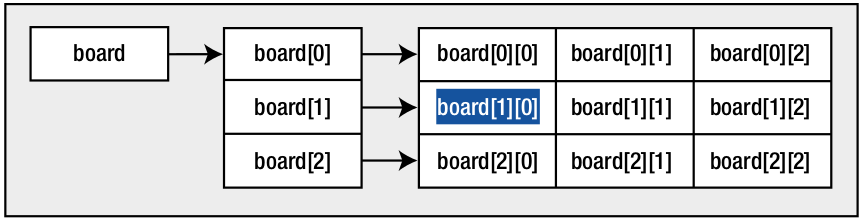
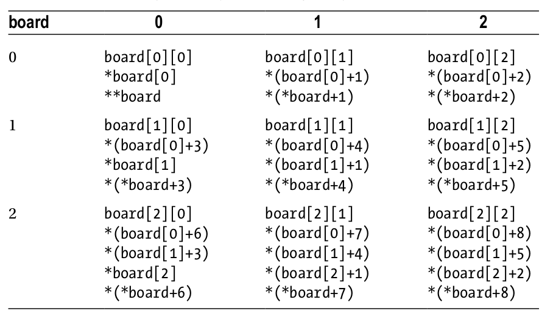

# Pointers - Continued

## Objectives
1. Pointers and Two-Dimensional arrays
2. Dynamic Memory allocation
3. Homework exercises
4. Next steps


## Pointers and Two-Dimensional arrays
- Run the snippet below:
    ```c++
        #include <iostream>

        using namespace std;

        int main(){
            char board[3][3] = {
                    {'1', '2', '3'},
                    {'4', '5', '6'},
                    {'7', '8', '9'}
            };
            cout << "address of board: " << board << endl;
            cout << "address of board[0][0]: " <<(void*)&board[0][0] << endl;
            cout << "value of board[0]: " << (void*)board[0];
            return 0;
        }
    ```
    - The output might suprise you as all the cout statements will display the same thing.
    - What can we deduce from this? 
        - well, when we declare a one dimensional aray as `x[n1]`, the `[n1]` after the array name tells the compiler that it's an array with n1 elements.
        - when you declare a two dimensional array as `y[n1][n2]`, the compiler conceptually creates a one-dimensional array of size `n1`, in which each element is an array of size `n2`
- Now, if you recall from the previous lessons when we first discussed the multidimensional arrays (matrices), when you create a 2D array, you're basically reating an array of one-dimensional subarrays. So when you access the two-dimensional array using the arrray name with a single index value (i.e `board[0]`), for example, you're referencing the address of one of the subarrays. 
    - Using the 2D array name by itself, references the address of the beginning of the array of subarrays which is also the address of the beginning of the first subarray.
- To summarise all of these:
    ```c
        board
        board[0]
        &board[0][0]
    ```
    have the same value but they aren't the same thing:
    1. `board`- is the address of a two-dimensional array of char elements
    2. `board[0]` is the address of a one-dimensional array of char elements that is a subarray of `board`
    3. `&board[0][0]` - is the address of an array  element of type        char.

- Now, if we rewrite a bit the previous example, we can access the element of a 2D array using the indirection operator (`*`):
    ```c++
        #include <iostream>

        using namespace std;

        int main(){
            char board[3][3] = {
                    {'1', '2', '3'},
                    {'4', '5', '6'},
                    {'7', '8', '9'}
            };

            cout << "value of board[0][0]: " << board[0][0] << endl;
            cout << "value of *board[0]: " << *board[0] << endl;
            cout << "value of **board: " << **board << endl;
            return 0;
        }
    ```
    - Now, you can obser that if we want to use the `board` word as a mean of obtaining the value of the first element, you have to apply two indirection operators to get it: `**board`.
        - If you use only one `*`, you will get the address of the first element of the array of arrays, which is the address referenced by `board[0]`
- We can easily visualize the relationship betwen the multidimensional array and its subarrays in the image below:

    

- In the next example, we will display all the elements inside a matrix, using the indirection operator:
    ```c++  
        #include <iostream>

        using namespace std;

        int main(){
            char board[3][3] = {
                    {'1', '2', '3'},
                    {'4', '5', '6'},
                    {'7', '8', '9'}
            };

            for(int i =0; i < 9; i++) {
                cout << *(*board + i)<<" ";
            }
            return 0;
        }
    ```
    - The most important part of our snippet is how we dereference `board` in the loop:
        ```c++
            *(*board + i);
        ```
        we use the expression `*(*board + i)` to get the value of an array element. The expression betqween the parentheses, `*board + i`, produces the address of the element in the board array that is at offset `i`.
    - It is very important for us to include the brackets. Leaving them out would give us the value pointed to by board (i.e the value stored in the location referenced by the address stored in board) with the value of `i` added to this value. So if `i` had the value 2, you would simply output the value of the first element of the array plus 2. What we actually wanted to do, and also, what the expression does, is to add the value of `i` to the address contained in board and then dereference this new address to obtain a value
    - TODO: experiment with the previous snippet by omitting the parentheses.

    - Let's rewrite a bit the previous example by using a variable declared as a pointer to reference a 2D array.  If we declare a pointer and assign the address of the arry to it, then we can use the pointer to access the members of the array by modifying the address it contains:
        ```c++
            #include <iostream>

            using namespace std;

            int main(){
                int board[3][3] = {
                        {1, 2, 3},
                        {4, 5, 6},
                        {7, 8, 9}
                };

                int *pBoard = *board;
                for(int i =0; i < 9; i++) {
                    cout << *(pBoard + i)<<" ";
                }
                return 0;
            }
        ```
    - Even though we get the same result, the difference is that now we initialize `pBoard` with the address of the first element of the array, and then we use normal pointer arithmetic to move through the array.
    - Also note how you dereference board to obtain the address you want (with `*board`). This is necessary because board by itself is of type `char**`, a pointer to a pointer, and is the address of the subarray `board[0]`. It is not the address of an element, which must be of type `int*`.
    - We could havbe also initialized `pBoard` by using the following:
        ```c++
            int *pBoard = &board[0][0]
        ```
- For the sake of future usages, you can take a look at the image below to visualise several ways of accessing the elements in an array using pointers:


## Dynamic memory allocation
- The C and C++ languages have a feature called `dynamic memory allocation` that depends on the concept of a pointer and provides a strong incentive to use pointes in your code.
- Dynamic memory allocation allows memory for storing data to be allocated dynamically when you program executes. Allocating  memory dynamically is possible only because you have pointers available.
- Most importantly, all real life applications use dynamic memory application so it is something which worths to pay attention to.
- The first example, which can be used to exemplify the use of dynamic memory alocation is again, something which has to do with arrays. Think to a program which will compute and store the average grade of the students from a class with ten children. For this, we will need an array of 10 elements. What is clear from this is the fact that we need to know for sure, in advance, how large should our array be, prior to using it. Ideally, we would like to create the array to be exactly as we need, without wasting memory (i.e creating an array of 100 elements, and only using 10).
    - With dynamic memory allocation we can create arrays at runtime that are just large enough to hold the amount of data we require for a specific task.

NOTE: just for having a subject of conversation with the smart guys, keep in mind the fact that when you explicitly allocate memory at runtime in a program, space is reserved for you in a memory area called the `heap`. There's another memory area called the `stack` associated with a program in which space to store function arguments and local variables in a function is allocated. When the execution of a function ends, the space allocated to store arguments and local variables is freed. The memory in the heap is different in that it is controlled by you. The only problem with this is that when you allocated memory on the heap, it is up to you to keep track of when the memory you have allocated is no longed required and free the space you have allocated to allow it to be reused.

### Dynamic memory allocation using the `malloc` function
- in order to allocate memory at runtime explictly, we can use the standard function library function called `malloc`. In order to use it, we have to include the `stdlib.h` header file in the program.
- When you use the `malloc()` function, you specify the number of bytes of memory that you want allocated as the argument. The function returns the address of the first byte of memory that it allocated in response to your request. Because you get an address returned, a pointer is the only place to put it.

- A typical example of dynamic memory allocation might look like this:
    ```c++
        int *pNumber = (int*)malloc(100); // here 100 is how many bytes we want to allocated
    ```
    We have requested 100 bytes of memory and assigned the address of this memory block to pNumber. As long as we haven't modified it, any time that we use the variable pNumber, it will point to the first int location at the beginning of the 100 bytes that were allocated. This whole block can hold 25 int values (as long as int required 4 bytes). 
    - There is something which feels odd with the above statement as relies on the fact that int is always 4 bytes (which might not be the case) and also, it makes us to think, which we don't cause we are lazy, so it is better for us, lazy guys, to rewrite it as follows:
        ```c++
            int *pNumber = (int*)malloc(25 * sizeof(int));
        ```
        now it is very easy for us to see that we allocate enough memory to store 25 integer values.
    - Also note the cast `(int*)`, which converts the address returned by the function to the type pointer to int. The function `malloc()` is a general-purpose function that is used to allocate mmemory for any type of data.  The function has no knowledge of what you want to use the memory for, so it returns a pointer of type pointer to void, which, as you know, is written as `void*`.  Pointers of type `void*` can point to any kind of data, however, you can't dereference a pointer of type pointer to void because what it points to is unspecified. Even though the compiler will always arrange for the address returned by `malloc()` to be automatically converted to the pointer type on the left of the assignment, it doesn't hurt to put an explicit cast.
- Note that you can request any number of bytes, subject only to the amount of free memory on the computer and the limit on malloc() imposed by a particular implementation. If the memory that you request can't be allocated for any reason, `malloc()` returns a pointer with the value `NULL`, thus it is a good idea to check for `NULL` any dynamic memory request immediately after allocation. So, always have something like this in code: 
    ```c++
        int *pNumber = (int*)malloc(25*sizeof(int));
        if(!pNumber)
        {
        // Code to deal with memory allocation failure . . .
        }
    ```
### Releasing dynamically allocated memory
- each dynamic memory allocation should always be followed by its release, when it is no longer needed.
- Memory allocated on heap wil be automatically released when your program ends but this might be too late because it might turn into memory leak(s).
- A memory leak occurs when you allocate some memory dynamically and you do not retain the references to it, so you are unable to release the memory. This issue often occurs within a loop.
- Very important: in order to free memory that you have allocated dynamically, you must still have access to the address that references the block of memory.
- To release the memory for a block of dynamically allocated memory whose address
you have stored in the pointer pNumber, you just write this statement:
    ```c++
        int *pNumber = (int*)malloc(25*sizeof(int));
        if(!pNumber)
        {
        // Code to deal with memory allocation failure . . .
        }
        // DO SOMETHING USEFUL WITH THE POINTERDD
        free(pNumber);
        pNumber = NULL;
    ```
- The free function has a formal parameter of type `void*`, and because any pointer type can be automatically converted to this type, you can pass a pointer of any type as the argument. As long as pNumber contains the address that was returned when the memory was allocated, the entire block of memory will be freed for further use. You should always set the pointer to `NULL` after the memory that it points to has been freed.

- If you pass a NULL pointer to the free() function, the function does nothing. You should avoid attempting to free
the same memory area twice, because the behavior of the free() function is undefined in this instance and therefore
unpredictable. You are most at risk of trying to free the same memory twice when you have more than one pointer
variable that references the memory you have allocated, so take particular care when you are doing this. 

- Now let's do a small exercise in which we will practice these memory allocation and release techniques. So, let's create a program which will find the minimum element from an array whose size is read at runtime.
    ```c++
        #include <iostream>
#include <stdlib.h>

using namespace std;

int main(){
    cout << "enter the size of the array: ";
    int n;
    cin >> n;
    int *elements = (int*)malloc(n * sizeof(int));
    for(int i =0; i < n; i++) {
        cout << "Enter element #"<<i+1<<": ";
        cin>> *(elements+i);
    }

    int min = *elements;
    for(int i = 0; i < n; i++) {
        if(*(elements+i) < min){
            min = *(elements+i);
        }
    }

    cout << "The minimum element is: "<< min;
    free(elements)
    return 0;
}

    ```
## Exercises
1. Create a C++ program which finds the minimum element from a 2D array, using pointers.
2. Create a C++ program which will compute the sum of all elements above the second diagonale of a 2D array, using pointers.
3. Create a C++ function which swaps the values of two int variables received as arguments.
4. Create a C++ program which will read a `NxM` matrix from standard input, where `N` represents the number of rows and `M` represents the number of columns.

## Next steps
- In the next lesson we will take a look at further strings manipulation using pointers and dynamic memory allocation techniques.
- Also, we will see more examples with dynamic memory allocatin and a small example of passing by reference vs passing by value