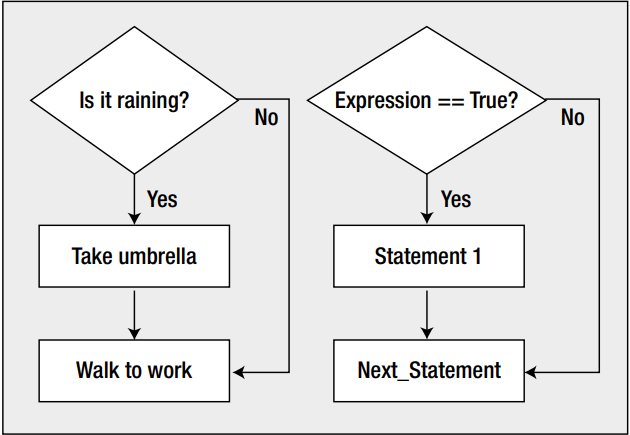
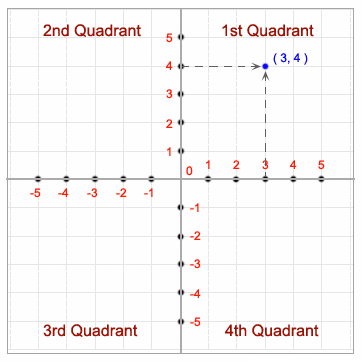

# Session 6

### Boolean type

- A boolean type can hold only two values: 
    - __true__
    - __false__

- It is typically used when we want to check if a certain arithmetic expression is true or false. e.g:
    - if a number is greater than 0, then print it
    - if the temperature is higher than 21 degrees, then turn down the heater
    - If the price of the game is between 150 ron and 200 ron then buy it.

- VERY IMPORTANT:
    - In C and C++, a boolean value is also seen as an integer value. 
        - Everything which is different than 0 is true, otherwise false:
            - `0 -> evaluates to false`
            - `1 -> evaluates to true`
            - `9999 -> evaluates to true`
            - `-2 -> evaluates to true`
- In order to declare a variable of  boolean type, we have to do the following steps:
    - add the `#include <stdbool.h>` directive
    - declare the variable using the `bool` type:
        - `bool isOdd = true`

### Making decisions

- In this section we will focus on one of the most important features of a programming languages, namely the ability to compare the values of expressions.
- By `decision making` we mean the ability of choosing to execute one set of program statements rathern than another, based on the data.
    - This is very similar with decisions in everyday life:
        - ```c
            if it is not raining outside then go to tennis`
            else stay inside and play battlefront
          ```

- All decisions involve comparisons. In the next subsection we will explore how can we compare numeric values in C

#### Arithmetic comparisons

- Comparing thingsa in C involves some new operators. You have six relational operators that can be used to compare two values

|Operator | Comparison                                                       |
|-------- |----------------------------------------------------              |
|`<`      | Is the left operand `less than` the right operand?               |
|`<=`     | Is the left operand `less than or equal` to the right operand?   |
|`==`     | Is the left operand `equal` to the right operand?                |
|`!=`     | Is the left operand `not equal` to the right operand?            |
|`>`      | Is the left operand `greater than` the right operand?            |
|`>=`     | Is the left operand `greater than or equal` to the right operand?|

- Each of the previous comparisons results in a value of type `int`:
    - `1` if the comparison is true
    - `0` if te comparison is false
- The following expressions:
    - `2 != 3` -> `true`
    - `5 > 3` -> `true`
    - `(2 * 2) == (4 * 1)` -> `true`
    - `5 < 1` -> `false`
    - are called `logical expressions` or `Boolean expressions` because they result in just on of two values: either `true` or `false`.

- Because a relational operator produces a Boolean result, you can store the result in a variable of type bool:
    - `bool result = 5 < 4;` // result will be false

- VERY IMPORTANT:
    - It is very simple to confuse the assignment operator (e.g `=`) with the `equal to` operator (e.g `==`)
    - For example:
        ```c
            int a = 10;
            int b = 5;
            a == b; // this statement compares a's value with b's value, namely if 10 is equal with 5
            a = b; // this statement will set the new value for a to be 5;
        ```

#### The Basic `if` statement

- In C, one of the simplest statements for making decision is the `if` statement
- The snippet below compare your height with someone else and print a different sentence depending on the results:
    ``` c
    #include <stdio.h>
    #include <stdlib.h>
    int main()
    {
        int myHeight = 172;
        int andreisHeight = 182;
        
        if(myHeight > andreisHeight){
            printf("I am taller than Andrei");
        }

        if(myHeight < andreisHeight){
            printf("Andrei is taller than me");
        }

        if(myHeight == andreisHeight){
            printf("We have the same height");
        }
        return 0;
    }

    ```
    - There are three if statements here
    - The boolean expression for the comparison in each case, appears between the parantheses that immediately follow the keyword if. 
    - If the result of a comparison is `true`, the statement immediately after the `if` will be executed.
    - If the result of a comparison is `false`, the statement following the `if` will be skipped.11

- In the image below we can see the process of making decision illustrated with a diagram:

    - 

- The snippet below asks the user to enter a number between 1 and 10 and the output will tell how that number relates to 5 or 6
    - ```c
        #include <stdio.h>
        #include <stdlib.h>
        int main()
        {
            int number = 0;
            printf("\nEnter an integer between 1 and 10:");
            scanf("%d", &number);

            if(number > 5){
                printf("You entered  %d which is greater than 5\n", number);
            }

            if(number < 6){
                printf("You entered %d which is less than 6\n", number);
            }
            return 0;
        }
      ```
- The  `if` statement allows us to limit the input that we accept.
    - For example, if we had a banking application and the user will try to withdraw more money than she has in the account, we will reject the operation and will print an `Insufficient founds` message.

#### Extending the `if` statement: `if-else`

- Let's take a look at the following snippet: 
    - ```c
        #include <stdio.h>
        #include <stdlib.h>
        int main()
        {
            int temperature = 20;

            if(temperature < 20){
                printf("I will wear the jacket")
            }
            
            if(temperature > 20) {
            printf("I will take the t-shirt");
            }
            return 0;
        }
      ```
    - This program checks the temperature. If it is cold  (less than 20 degrees), the jacket is needed. Else, if there hot, the t-shirt will be weared. As there is no chance that both expressions will be true at the same time, we can rewrite the program in a more compact way using the `if-else` statement:
    - ```c
        #include <stdio.h>
        #include <stdlib.h>
        int main()
        {
            int temperature = 20;
            if(temperature < 20){
                printf("I will wear the jacket")
            } else {
            printf("I will take the t-shirt");
            }
            return 0;
        }
      ```
    - As you can see, the program now became more human readable.
    - The expressions are evaluated top-down as follows:
        - if the first expression is `true` then execute the statement(s) in the first if's scope
        - else execute the statement(s) which are in the scope of the `else`'s scope
    - It is also possible to have multiple `if`'s but there will always be only one `else`, tough it is not mandatory to have it. See the snippet below:
        - ```c
            #include <stdio.h>
            #include <stdlib.h>
            int main()
            {
                float temperature;
                printf("Please enter the temperature in Celsius degrees: ");
                scanf("%f", &temperature);
                printf("Entered temperature is: %f\n\n", temperature);
                if(temperature < 0) {
                    printf("It is freezing outside :-s");
                } else if (temperature < 10) {
                    printf("It is very cold outside");
                } else if (temperature < 20){
                    printf("It is cold outside:-s");
                } else if ( temperature < 30) {
                    printf("It is a perfect weather outside");
                } else if (temperature < 40){
                    printf("It is warm outside");
                } else {
                    printf("It is VERY VERY HOT outside");
                }

                return 0;
            }
          ```
            - Here, the expressions will be evaluated again, from top-down. And the first one to be true, will be executed
    - Having said all of these, we can generalise the syntax of a `if-else` statement like: 
        - ```c
            if expression1 {
                statement1
            } else if (expression2) {
                statement2;
            } else if (expressionN) {
                statementN
            } else {
                otherStatement;
            }
          ```

#### `if-else` syntax in depth

- Until now, we have seen the `if-else` statements to be used like this:
    - ```c
        if (expression1) {
            statement1
        } else if (expression2) {

            statement2;
        } else {
            otherStatement;
        }
       ```
    - When we have only one statement to be executed for a certain conditional step, we can omit the `{}`, thus the previous snippet will look like:
        - ```c
            if (expression1) 
                statement1
            else if (expression2)
                statement2;
            else 
                otherStatement;
          ```
        - we can also have them one-line:
            - ```c
                if (expression1) statement1
                else if (expression2) statement2;
                else otherStatement;
            ```
    - As you can see, we can skip the usage of `{}`, but most of the time it is a good practice to use them, even though we have only one statement to be executed. Otherwise we might encounter hard to find bugs.
    - When we are not using braces in an `if` expression, it will only execute the next line after it. See the snippet below for a better understanding:
        - ```c
            #include <stdio.h>
            #include <stdlib.h>
            int main()
            {
                int age;
                printf("Please enter your age: ");
                scanf("%d", &age);
                if (age > 100)
                    printf("Your age is incorrect. We are updating it automatically to 50");
                    age = 50;
                printf("Your age is: %d", age);
                return 0;
            }
           ```
            - We want to create a dummy program which reads the age from the terminal and if the age is greater than 100, we are automatically change it to 50. But if we run the program as it is, the age will always be 50 as the `age = 50` statement is always executed.
            - A quick fix is to surround with `{}` the statements which we want to be executed when the `boolean expression` evaluates to `true`:
                - ```c
                    #include <stdio.h>
                    #include <stdlib.h>
                    int main()
                    {
                        int age;
                        printf("Please enter your age: ");
                        scanf("%d", &age);
                        if (age > 100) {
                            printf("Your age is incorrect. We are updating it automatically to 50");
                            age = 50;
                        }
                        printf("Your age is: %d", age);
                        return 0;
                    }
                  ```
##### Class Exercises

1. Create a program which enables the selling of a product which costs 3.50 ron per single-unit. If the client will buy more than 10 products, then offer a 5% discount. 
    - Solution:
        - ```c
            #include <stdio.h>
            #include <stdlib.h>
            int main()
            {
                double productPrice = 3.50;
                double totalCost = 0.0;
                int quantity=0;
                printf("Welcome to our shop.\nHow many products do you want to buy?\n");
                scanf("%d", &quantity);

                if(quantity > 10){
                    totalCost = productPrice * quantity * 0.95;
                } else {
                    totalCost = productPrice * quantity;
                }
                printf("Your total cost for %d products is: %.2f RON", quantity, totalCost);
                return 0;
            }
          ```
2. Write a C program to accept two integers and check whether they are equal or not.
    - a) Input: 13 13
       Expected output: number1 and number2 are equal.
    - b) Input 13 31
       Expected output: number1 and number2 are not equal
    - Solution: 
        ```c
            #include <stdio.h>
            #include <stdlib.h>
            int main()
            {
                int number1, number2;
                printf("Please enter two numbers separated by space: ");
                scanf("%d", &number1);
                scanf("%d", &number2);
                if(number1 == number2){
                    printf("number1 and number2 are equal");
                } else {
                    printf("number1 and number2 are not equal");
                }
                return 0;
            }
        ```
3.  Write a C program to check whether a given number is even or odd.  
    - a) Input: 21
         Expecrted output: 21 is an odd number
    - b) Input 46
         Expected output: 46 is an even number
    - Solution: 
        ```c
            #include <stdio.h>
            #include <stdlib.h>
            int main()
            {
                int number;
                printf("Please enter a number ");
                scanf("%d", &number);
                if (number % 2 == 0) {
                    printf("%d is an even number", number);
                } else {
                    printf("%d is an odd number", number);
                }

                return 0;
            }
        ``` 
4. Write a C program to find whether a given year is a leap year or not.
    - a) Input 2016
         Expected output: 2016 is a leap year with 366 days
    - b) Input 2017
         Expected output: 2017 is a common year with 365 days
    - Solution:
        - ```c
            #include <stdio.h>
            #include <stdlib.h>
            int main()
            {
                int year;
                printf("Please enter the year to be checked: ");
                scanf("%d", &year);
                if ( year % 4 != 0) {
                    printf("%d is a common year with 365 days", year);
                } else if (year % 100 != 0){
                    printf("%d is a leap year with 366 days", year);
                } else if (year % 400 != 0){
                    printf("%d is a common year with 365 days", year);
                } else {
                    printf("%d is a leap year with 366 days", year);
                }

                return 0;
            }
          ``` 
5. Write a C program to accept a coordinate point in a XY coordinate system and determine in which quadrant the coordinate point lies.
    - a) Input: 3 4
         Expected output: The point P(3,4) lies in the first quadrant
    - b  Input -3 -3
         Expected output: The point P(-3,-3) lies in the third quadrant
    - 
    - Solution:
        - ```c
            #include <stdio.h>
            #include <stdlib.h>
            int main()
            {
                int x, y;
                printf("Enter the coordinate of the Point, separated by space: ");
                scanf("%d %d", &x, &y);
                if(x > 0 && y > 0){
                    printf("The point P(%d, %d) is in the first quadrant", x, y);
                } else if( x < 0 && y > 0){
                    printf("The point P(%d, %d) is in the second quadrant", x, y);
                } else if( x < 0 && y < 0){
                    printf("The point P(%d, %d) is in the third quadrant", x, y);
                } else if( x > 0 && y < 0){
                    printf("The point P(%d, %d) is in the fourth quadrant", x, y);
                } else {
                    printf("The point P(%d, %d) is in the origin", x, y);
                }

                return 0;
            }

          ```

### Homework exercises

1. You’re selling a product that’s available in two versions: type 1 is a
standard version priced at $3.50, and type 2 is a deluxe version priced at $5.50.
Write a program that prompts the user to enter the product type and a quantity, and then calculates and outputs the price for the quantity entered.
    - Input: 1  10
    - Output: $35.0
2.  Write a program in C to read any day number in integer and display day name in the word.
    - Input: 4
    - Output: Thursday
3. Write a program in C to read any Month Number in integer and display Month name in the word.
    - Input: 4
    - Output: April
4. Write a program in C to read any Month Number in integer and display the number of days for this month.
    - Input: 7
    - Output: Month have 31 days
    - Note: there are multiple months with 31 and 30 days
5. Write a C code that prompts the user to input tree integer values and find the greatest value of the three values.
    - Input: 3 7 1
    - Output: The greatest number is 7
6. Write C code to compute the real roots of the equation: ax^2+bx+c=0.
    - More details about how an equation of second degree is resolved, here: https://ekuatio.com/en/how-to-solve-second-degree-equations-step-by-step-resolved-exercises/
            