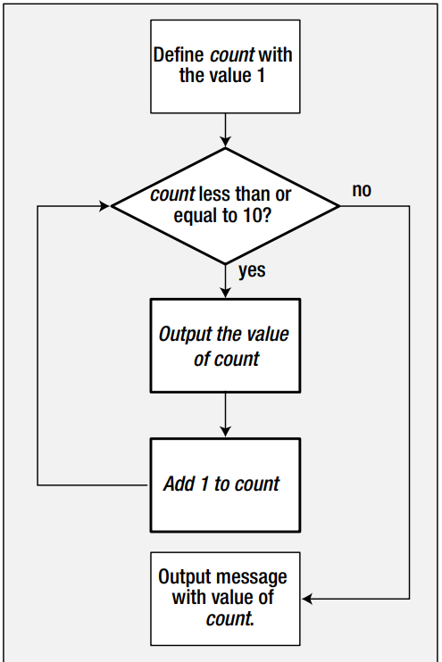

# Session 7

## Loops

- Loop means to repeat certain operation until a condition is met
- The number of steps that should be performed should be known otherwise an error will be thrown (Stack Overflow).
- Until we go straight into the loops theory we should remind about the:
    - increment operator
        - ```++```
        - e.g `a++` is the same as `a+=1` or `a=a+1`
        - keep in mind that there is a difference between `++a` and `a++`
            - eg:
                ```c
                    int a = 10;
                    int b = 11;
                    cout << ++a; // this prints 11
                    cout << b++; // this prints 11
                    cout << b; // now b is 12
                ```
            - always keep in mind that if the operator comes in front of the variable then you do that operation and afterwards the rest
    - decrement operator
        - ```--```
        - e.g `a--` is the same as `a-=1` or `a=a-1`
        - keep in mind that there is a difference between `--a` and `a--`
            - eg:
                ```c
                    int a = 10;
                    int b = 11;
                    cout << --a; // this prints 9
                    cout << b--; // this prints 11
                    cout << b; // now b is 10
                ```
            - always keep in mind that if the operator comes in front of the variable then you do that operation and afterwards the rest

## The `for loop`

- We typically use the for loop to execute a block of statements a given number of times. 
    - Let's suppose you want to display the numbers from 1 to 10. Instead of writing ten statements that coul `cout`, we can write it like this:
        - ```c++
            for (int count = 1; cout <=10; count++) {
                cout << count << " ";
            }
        ```
- The basic syntax of a for loop is:
    - ```c
        for(init_var;condition;increment_var){
            //run the action
        }
        ```
    - note:
        - `init_var` - this is the part which executes only once, at the begginning of the loop.
            - it is used for initializing the counter, a.k.a the number which determines how many time the loop should run
        - `condition` - this is the part which is evaluated at the begginning of each loop
            - if it evaluates to `true` then the loop continues
            - if it evaluates to `false` then the loop ends
        - `increment_var` - this is the part which runs at the end of each cycle
            - it should increment the counter
    - Example: 
        - Compute the sum of numbers from 1 to 100:
            - ```c
                int sum = 0
                for(int i = 1; i <=100;i++){
                    sum += i;
                }
                cout <<"Sum is: " << sum;
            ```
        - Keep in mind the following:
            - the expression `int i = 1` is executed only once
                - `i` is available only inside the `for loop`
                - if we attempt to reference the `i` after we exit the loop, the code will not compile
            - The expression `i <= 100` will be checked at each iteration
                - an `iteration` is simply one execution of a loop scope
                    - if, for example, our  `for loop` runs for 10 times, we say that we had `10 iterations`
                - in a loop, the second expression must always be one which should evaluate to either `true` or `false`
            - The expression `i++` is executed after each `sum+=i`.
            - Also very important, keep in mind that each expression in the header of a for loop should be preceded by a semicolon (`;`):
                - for(exp1`;`exp2`;`exp3)
- In a `for` loop, we can omit completely the first statement which will initialize some counter, as long as this counter is initialized before the `for` loop. See the snippet below:
    - ```c
        int count = 1;
        for (;count <=10;count++){
            cout<<count;
        }
        cout << "after the loop, count has the value " << count;
        ```

    - We should observe the following:
        - even if the counter is initialized outside, we still use the `;` separator as before
        - unlike what we have seen before, when the `i` variable was not available outside the `for` loop, the `count` variable is still visible even outside the loop because was declared outside of the `for lop`
    - Below we can see a logical diagram which describes the flow of the program:
    -  

- Exercise 1: write a C++ program which draws the following box:
    ```c
        ********************
        *                  *
        *                  *
        *                  *
        *                  *
        *                  *
        *                  *
        *                  *
        *                  *
        *                  *
        *                  *
        ********************
    ```
    - Solution:
        - ```c++
            #include <iostream>

            using namespace std;

            int main()
            {
                cout << "********************";
                for (int i = 0; i < 12; i++){
                    cout<< "\n*                  *";
                }
                cout << "\n********************" <<endl;
            }
        ```
- Exercise 2: Write a program in C++ to display n terms of natural number and their sum
    - Input: 7
    - Expected Output:
        - The first 7 natural numbers are: 1 2 3 4 5 6 7
        - The Sum of Natural Numbers up to 7 is 28
    - Solution: 
        ```c++
            #include <iostream>
            int main() {
                int n, sum = 0;
                std::cin >> n;
                for(int i = 1; i <= n; i ++){
                    std::cout<<i<< " " ;
                    sum += i;
                }
                std::cout<<"\nThe sum of natural numbers up to " <<n << " is " << sum;
                return 0;
            }
        ```
- Exercise 3: Write a program in C++ to read 10 numbers from keyboard and fint their sum and average.
    - Input example:
        - Number 1: 2
        - Number 2: 5
        - Number 3: 55
        - ...
        - Number 10:322
    - Expected output:
        - The sum of the 10 numbers is: 55
        - The average is: 4.556
    - Solution: 
        ```c++
            #include <iostream>

            int main() {
                int n, sum = 0, average;
                for(int i = 1; i <= 10; i ++){
                    std::cout<<"Number "<< i <<": ";
                    std::cin>>n;
                    sum += n;
                }
                std::cout<<"\nThe sum of the 10 numbers is " << sum<<std::endl;
                std::cout<<"The average is: " <<sum / 10.01 <<std::endl;
                return 0;
            }
        ```
- Exercise 4: Write a program in C++ to display the cube of the number up to a given integer
    - Input example:
        - Input number of terms: 5
    - Expected output:
        - Number is: 1 and cube of 1 is 1
        - Number is: 2 and cube of 2 is 8
        - Number is: 3 and cube of 3 is 27
        - Number is: 4 and cube of 4 is 64
        - Number is: 5 and cube of 5 is 125
    - Solution:
        ```c++
            #include <iostream>
            int main() {
                int n;
                std::cout<<"Input number of terms: ";
                std::cin>>n;
                for(int i = 1; i <= n; i ++) {
                    std::cout << "Number is: " << i << " and cube of " << i << " is " << i * i * i<<std::endl;
                }
                return 0;
            }
        ```
- Exercise 5: Write a program in C++ to display the pattern of a right triangle using a number
    - Expected output:
        ```c++
            1
            1 2
            1 2 3
            1 2 3 4
        ```
    - Solution:
        ```c++
            #include <iostream>

            int main() {
                for(int i = 1; i <= 4; i++) {
                    for(int j = 1; j <= i; j ++) {
                        std::cout<< j << " ";
                    }
                    std::cout<<std::endl;
                }
                return 0;
            }
        ```
    - Advanced:
        - Try to make the height of the triangle to be read from the standard input

- Exercise 6: Write a program in C++ to display the multiplication table vertically from 1 to n.
    - Input example:
        - Enter the number up to which you want to display the multiplication table: 8
    - Output example:
        - Multiplication table from 1 to 8
        - 1 x 1 = 1, 2 x 1 = 2, 3 x 1 = 3, ... 8 x 1 = 8
        - 1 x 2 = 2, 2 x 2 = 4, 3 x 2 = 6, ... 8 x 2 = 16
        - 1 x 3 = 3, 2 x 3 = 6, 3 x 3 = 9, ... 8 x 3 = 24
        - ...
        - 1 x 10 = 10, 2 x 10 = 20, 3 x 10 = 30, 4 x 10 = 40, ... 8 x 10 = 80
    - Solution: 
        ```c++
            #include <iostream>

            int main() {
                int n;
                std::cout<<"Enter the number up to which you want to compute the multiplication table: ";
                std::cin>>n;
                    for(int j = 1; j <= 10; j ++ ) {
                        for(int i = 1; i <= n; i ++) {
                            std::cout << i << " x " << j << " = " << i * j << "\t";
                        }
                        std::cout << std::endl;

                    }
                return 0;
            }
        ```

## Homework exercises
- Exercise 1: Write a program in C++ to display the first n odd numbers
    - Input example:
        - Enter how many odd numbers you want: 10
    - Expected output:
        - The odd numbers are: 1 3 5 7 9 11 13 15 17 19
        - The sum of first 10 odd numbers is 100

- Exercise 2: Write a program in C++ to display the pattern of a right triangle using an asterisk
    - Expected output:
       ```C++
            *
            * *
            * * *
            * * * *
        ```
- Exercise 3: Write a program in C++ to display the n terms of harmonic series and their sum
    - Input example:
        - Input the number of terms: 5
    - Expected output:
        - 1/1 + 1/2 + 1/3 + 1/4 + 1/5
        - Sum of Series up to 5 terms is 2.283334

- Exercise 4: Write a program in C to find the sum of the series 1 + 11 + 111 + 1111 + ... n terms
    - Input example:
        - Input the number of terms: 5
    - Expected output:
        - 1 + 11 + 1111 + 11111
        - The sum is 12345

- Exercise 5: Write a program in C++ to read a number from the standard input and display it in reverse order.
    - Input example:
        - Enter the number: 54321
    - Expected output:
        - The number reversed is: 12345

- Exercise 6: Write a program in C++ to check whether a number is a palindrom or not
    - Input example:
        - Enter the number: 121
    - Expected output:
        - 121 is a palindrome number
